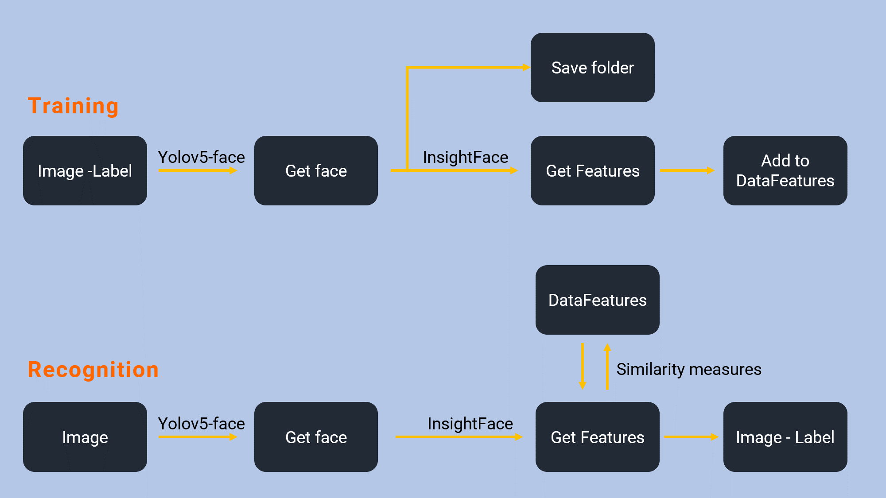

# Real-Time Face Recognition
<p align="center">
  
</p>

# Cara menambahkan 1 orang untuk dikenali
Langkah 1: Buat folder dengan nama folder sesuai dengan nama orang tersebut
Misalnya, jika nama orang tersebut adalah "Nino Nakano", buatlah folder dengan nama "Nino Nakano".

Langkah 2: Tambahkan foto orang tersebut ke dalam folder
Tambahkan foto-foto yang menampilkan orang tersebut ke dalam folder yang telah dibuat. Pastikan foto-foto tersebut memiliki variasi pose dan ekspresi wajah yang berbeda-beda untuk memperbaiki kemampuan sistem dalam mengenali orang tersebut.

Langkah 3: Pindahkan folder ke dalam folder "additional-training-datasets"
Pindahkan folder yang berisi foto-foto orang tersebut ke dalam folder "additional-training-datasets". Folder "additional-training-datasets" adalah tempat untuk menyimpan dataset tambahan yang akan digunakan untuk melatih sistem agar dapat mengenali orang baru.

Contoh:
Misalnya, jika Anda ingin menambahkan orang dengan nama "Nino Nakano", buatlah folder dengan nama "Nino Nakano" dan tambahkan foto-foto Nino Nakano ke dalam folder tersebut. Setelah itu, pindahkan folder "Nino Nakano" ke dalam folder "additional-training-datasets". Dengan demikian, sistem akan menggunakan dataset ini untuk melatih diri dalam mengenali Nino Nakano.

- |database
- ----|additional-training-datasets
- --------|name-person1
- --------|name-person2
- ----|face-datasets
- ----|full-training-datasets

Contoh :
- |database
- ----|additional-training-datasets
- --------|nama_kalian
- --------------| Taro foto kalian disini minimal 5 dengan atas bawah kanan kiri tengah
- --------|nama_kalian2
- --------|face-datasets
- --------|full-training-datasets

### Step 4: Set up dengan Python >= 3.7
````
pip install -r requirements.txt
````
### Step 5: Jalankan untuk menambahkan training orang
````
python train.py --is-add-user=True
````
### Step 6: Jalankan recognize
````
python recognize.py
````
# Face Recognition use Yolov5-face, Insightface, Similarity Measure 
<p align="center">
  
</p>

# Yolov5-face to dectect face
<p align="center">
  
</p>

# Insight Face to recognition face


# Multi thread
<p align="center">
  
</p>

# Cosine Similarity Algorithm


# Reference
- https://github.com/deepcam-cn/yolov5-face
- https://github.com/deepinsight/insightface/tree/master/recognition/arcface_torch
